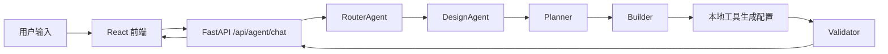

# Heya Studio 架构说明

更新时间：2026-04-29

## 当前主线

Heya Studio 当前主线是：前端 React 编辑器 + Python FastAPI 后端 + Planner → Builder → Validator AI 生成链路。`backend/` 里的 Cloudflare Workers 后端暂时只作为历史/实验实现保留。

## 模块职责

- `frontend/`：用户界面，负责聊天输入、工作流状态展示、画布预览和编辑。
- `frontend/src/services/api.ts`：前端 API 客户端，统一调用 Python 后端 `/api/*`。
- `backend-python/src/main.py`：FastAPI 入口，负责路由、会话、工作流事件和前后端契约适配。
- `backend-python/src/router/agent.py`：识别用户意图，把新建、修改、闲聊分发到对应 Agent。
- `backend-python/src/agents/design.py`：新建主页主 Agent，当前默认走 Planner → Builder → Validator。
- `backend-python/src/agents/planner.py`：理解用户输入，输出意图、主题、组件方向和执行计划。
- `backend-python/src/agents/builder.py`：调用工具生成页面配置，避免 LLM 直接拼完整 JSON。
- `backend-python/src/agents/validator.py`：校验配置结构、语义匹配和布局规则，并给出修复信息。
- `backend-python/src/agents/pipeline.py`：串联 Planner、Builder、Validator 和 Repair 的轻量状态图。
- `backend-python/src/tools/`：配置生成、布局、组件搜索、主题匹配、语义校验等可复用工具。
- `backend-python/src/models/`：页面、主题、布局、反馈等数据模型。
- `backend-python/tests/`：后端回归测试，保护 API 契约和 AI 主链路。
- `docs/api-contract.md`：前后端接口状态和约定。
- `CONTEXT.md`：当前进度、最近决定和下一步。

## 调用关系

## 关键设计决定

1. **Python 后端是当前主线**：它的 Agent、测试和本地演示链路更完整，先不把 TS Workers 后端作为默认入口。
2. **LLM 不直接产出最终复杂 JSON**：LLM 负责理解和规划，工具负责生成配置，校验器负责兜底。
3. **保存/加载先用内存 mock**：当前目标是本地闭环演示，正式云端持久化放到部署阶段。
4. **先闭环再扩功能**：暂停继续堆新组件，优先打通生成、修改、预览、导出/分享。
